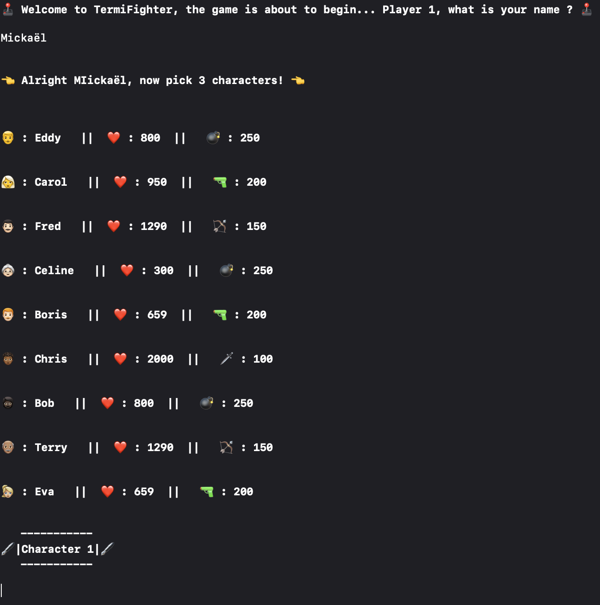

# OpenClassrooms-P3-TermiFighter

Welcome to TermiFighter, my very first Swift project designed to familiarize myself with the native iOS language.

TermiFighter is a text-based fighting game played in a terminal environment. 
In this game, players have the exciting task of selecting three characters from a diverse character roster and engaging in thrilling battles to emerge victorious.
The primary objective of this project was to gain proficiency in the Swift programming language while creating an entertaining and interactive gaming experience.

](https://github.com/MickaeliOS/OpenClassrooms-P3-TermiFighter/blob/main/Divers/GameLaunching.png)
